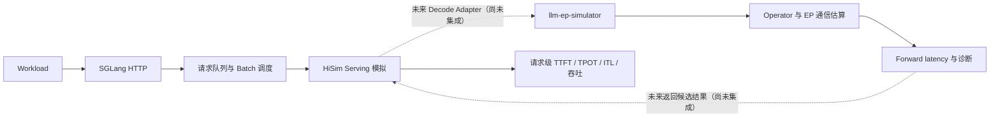

# HiSim 与 llm-ep-simulator 对比

## 1. 结论概览

HiSim 与 `third_party/llm-ep-simulator` 都是不执行真实 GPU kernel 的性能模拟工具，但关注层级不同：

- **HiSim** 侧重真实 serving 控制链路。它保留 SGLang HTTP 接入、请求队列、batch 形成和调度过程，再用 predictor 替代模型 forward，适合研究请求级吞吐、TTFT、TPOT、ITL 和排队行为。
- **llm-ep-simulator** 侧重模型内部分析。它把固定 DeepSeek-V3 Decode 展开成 Operator、Stage 和 Event DAG，分析 Expert Parallelism、计算通信重叠、显存、关键路径和 batch 上限。

当前仓库对 HiSim 的实测范围仅为 Qwen3-8B、H20 predictor 数据路径和 `TP=EP=PP=1`。H20 结果属于 `official_h20_data_path / INTEGRATION_ONLY`，只证明固定数据和功能路径成功集成，不是实体 H20 性能实测，也未经本机真卡独立校准。

`llm-ep-simulator` 当前只支持固定 DeepSeek-V3 Decode、H20/H800、单一 EP Group，`EP=8..256` 且必须是 8 的倍数；它不支持 TP。双方目前是相邻的独立能力，不应表述为已经集成。

## 2. 相同点

1. 都以解析模型或性能数据估算延迟，不加载完整模型权重执行真实 forward。
2. 都能在没有目标 GPU 的环境中运行，用于低成本集成验证、趋势分析和方案预筛选。
3. 都依赖模型结构、硬件参数和算子性能数据；输入数据是否匹配目标场景直接影响结果可信度。
4. 都能输出吞吐或时延结果，但结果属于模拟值，必须与实体 GPU 测量区分。
5. 都适合在昂贵真机实验前缩小候选范围，不能单独替代最终真机压测。

## 3. 主要差异

| 维度 | HiSim + SGLang | llm-ep-simulator |
| --- | --- | --- |
| 核心目标 | 模拟真实服务请求经过 SGLang 队列、调度和 batch 的全过程 | 分析 DeepSeek-V3 Decode 内部算子、EP 通信和资源排程 |
| 系统入口 | HTTP benchmark workload | Python 配置对象和每 rank Local Batch |
| 当前模型范围 | 本仓库已验证 Qwen3-8B；代码存在其他模型类型入口，但未在本项目实测 | 只支持固定 DeepSeek-V3：3 个 Dense 层、58 个 MoE 层 |
| 推理阶段 | 同时处理 Prefill 和 Decode；支持 SGLang Chunked Prefill 形成的逐轮 batch | 只处理 Decode；不建模 Prefill |
| 当前硬件范围 | 本仓库验证 H20 predictor 数据路径；generic smoke 使用上游 H100 fixture，但未经校准 | 固定支持 H20 和 H800，禁止跨硬件数据 fallback |
| 并行范围 | 当前已验证 `TP=EP=PP=1`，不能外推多卡能力 | 单一 EP Group，EP 8–256 且为 8 的倍数；无 TP、无 TP+EP |
| 调度层级 | SGLang 请求队列、连续 batch 和请求生命周期 | 单次模型运行内的 Compute/Communication Event DAG |
| 算子输出 | AIConfigurator 聚合 Prefill/Decode 算子时延，HiSim 主要消费 batch 总 forward latency | 显式输出 Attention、Dense/Shared/Routed Expert、Dispatch/Combine 等阶段明细 |
| 通信模型 | 当前项目未实测复杂 EP/TP collective 路径 | 使用 intra/inter fabric 有效带宽和启动时延估算 Dispatch/Combine |
| 序列建模 | 接收 SGLang 当前 batch 中各请求的新增 Token 和 past-KV 长度，再进行均值或校正 | KV cache length 固定为 5000；`q_seq_len` 只允许 1 或 2 |
| 路由建模 | 当前 Qwen3-8B 是 Dense 模型，没有形成经验证的 MoE 路由结果 | Uniform Expert Routing，支持 expert 不能整除 EP 时的轻重 rank class |
| 显存分析 | 依赖现有 predictor/runtime 的容量判断 | 显式分解常驻权重、KV cache、reserved memory 和 memory-safe batch |
| 诊断能力 | 请求级吞吐、TTFT、TPOT、ITL、排队和 iteration latency | Stage/Operator breakdown、Timeline、Critical Path、通信 Bytes 和瓶颈类别 |
| 搜索能力 | 当前以固定 workload profile 回归为主 | 支持 memory-safe batch 穷举和受预算 Resource Order Search |
| 当前结果边界 | H20 为 integration-only，未独立复现真卡精度 | 部分算子使用 proxy/外推；每次完整 run 都带 extrapolation 标记 |

## 4. 互补关系

两者可以形成“外层 serving + 内层模型执行”的分层模拟：

HiSim 可以提供真实请求到达、排队、动态 batch、Chunked Prefill 和请求完成过程；`llm-ep-simulator` 可以补充 DeepSeek-V3 Decode 内部的 expert placement、Dispatch/Combine、计算通信重叠和关键路径。这样既能解释服务指标，也能说明一次 Decode forward 的内部瓶颈。

不过，二者的 batch 语义、KV 长度和时间边界不同。正式结合前必须明确 SGLang scheduler batch 如何映射为 `batch_size_per_rank`，以及 `llm-ep-simulator` 的一次 makespan 是否等价于 HiSim 所需的一次 Decode forward latency。

## 5. HiSim 的优点

### 5.1 更接近真实服务入口

HiSim 直接挂接 SGLang 调度路径，能够从 HTTP workload 开始观察请求如何排队、组成 batch、经历 Prefill 和多轮 Decode，再形成 TTFT、TPOT、ITL 和吞吐。对服务链路回归而言，它比只分析单次静态 forward 更完整。

### 5.2 支持真实 workload 形态

当前项目既保留离线、确定性的 `random-ids` smoke test，也支持 ShareGPT 文本和长度分布。ShareGPT 只用于 workload shape，不评价回答质量，但能比固定 Token 长度更接近真实请求压力。

### 5.3 覆盖 Prefill、Decode 和 Chunked Prefill

SGLang 决定每轮进入 batch 的请求和 Token 数，HiSim predictor 分别估算 Prefill/Decode latency。长 prompt 被切成多个 chunk 时，模拟时钟可以累计多轮执行和排队影响。

### 5.4 易于做端到端集成回归

当前 Docker 环境固定了 SGLang、HiSim、AIConfigurator 和 CPU PyTorch 版本，并建立 workload 分类、结果 provenance 和 validator。它适合检查版本或代码变更是否破坏服务启动、请求处理、调度或指标输出。

### 5.5 Predictor 接口具有扩展位置

HiSim 在 SGLang hook 与具体 predictor 之间已有明确接口。未来可为特定模型和阶段增加专用 predictor，而不必重写 HTTP 和请求调度层。

相关实现可参考 [`sglang_hook.py`](../third_party/tair-kvcache/hisim/src/hisim/simulation/sglang/sglang_hook.py) 和 [`time_predictor`](../third_party/tair-kvcache/hisim/src/hisim/time_predictor/)。

## 6. HiSim 的缺点

### 6.1 当前 MoE、EP 和多卡证据不足

虽然模型元数据和 AIConfigurator 接口存在部分 MoE/EP 字段，本仓库没有部署或验证 DeepSeek-V3，也没有验证 `EP>1`、`TP>1`、TP+EP 或多节点路径。当前 Qwen3-8B/H20 结果不能支持多卡扩展结论。

### 6.2 内部瓶颈解释不如专用 Event 模型细

当前 SGLang hook 主要接收 predictor 返回的 batch 总 forward latency，再推进模拟时钟。它没有把每层 Attention、FFN、EP Dispatch/Combine 展开成独立的 Compute/Communication Event，因此难以直接回答通信隐藏比例或层内关键路径。

### 6.3 对 Predictor 数据和校正模型依赖较强

H20 路径依赖固定 AIConfigurator 数据库、Qwen3-8B XGBoost 校正和整体 scale factor。若目标软件版本、模型 shape 或硬件环境变化，原数据不能自动证明仍然准确。

### 6.4 部分 batch 信息会被聚合

Prefill predictor 使用 mean input、mean past-KV 和 attention imbalance correction；Decode 也使用平均 past-KV 选择名义长度。它能保留一定的长度差异影响，但不是逐请求、逐算子的完整执行模拟。

### 6.5 当前尚无本机真卡校准闭环

本项目已证明 H20 数据可以加载并驱动端到端仿真，但没有实体 H20 对照结果建立误差区间。模拟指标不能直接作为生产 SLA、容量规划或 H20/H100 横向比较依据。

## 7. 适用场景

### 优先使用 HiSim + SGLang

- 验证 HTTP、请求队列、SGLang 调度和 benchmark 全链路；
- 研究请求到达、并发、输入/输出长度对请求级指标的模拟影响；
- 回归 Chunked Prefill、prefix reuse 或不同 workload profile；
- 在无 GPU 环境下验证集成代码和结果格式。

### 优先使用 llm-ep-simulator

- 分析固定 DeepSeek-V3 Decode 在不同 EP 和 H20/H800 配置下的趋势；
- 研究 expert placement、轻重 rank、Dispatch/Combine 流量和 fabric 瓶颈；
- 对比 SINGLE/DUAL partition 和封闭 execution plan；
- 查看算子分解、显存上限、计算通信 overlap 和 Critical Path。

### 两者都不能单独回答

- 实体 GPU 上的最终吞吐和延迟；
- 生产 SLA、容量承诺和故障条件下的表现；
- 未经数据适配和真机校准的其他模型或 GPU；
- 模型回答正确性、幻觉或语义质量。

## 8. 未来结合方向

1. **先完成语义对齐。** 定义 SGLang Decode batch、`batch_size_per_rank`、KV 长度、EP topology 和单次 forward latency 的一一映射，不修改现有 HiSim 行为。
2. **增加受限 Decode adapter。** 仅在模型为 DeepSeek-V3、阶段为 Decode、硬件和 EP 配置受到支持时调用 `llm-ep-simulator`；Prefill 保持现有 predictor。
3. **保留诊断边界。** 除总 makespan 外，同时保存 extrapolation、算子明细、通信 Bytes 和 Critical Path，缺失数据时显式失败，不跨硬件静默 fallback。
4. **开展联合 workload 验证。** 使用 SGLang 实际 batch 和确定性/ShareGPT workload 检查请求级指标与内部 Event 结果是否一致。
5. **最后进行真机校准和扩展。** 先用目标 GPU 建立误差曲线，再逐项研究动态 KV 长度、非均匀 expert routing、更多 GPU、TP+EP 和多节点；不能从当前 H20/H800 或 `TP=EP=PP=1` 结果直接外推。

进一步的公式和模块分析见 [`llm_ep_simulator_reference_assessment.md`](llm_ep_simulator_reference_assessment.md)；当前 H20 predictor 的计算过程见 [`hisim_h20_inference_latency_calculation.md`](hisim_h20_inference_latency_calculation.md)。
