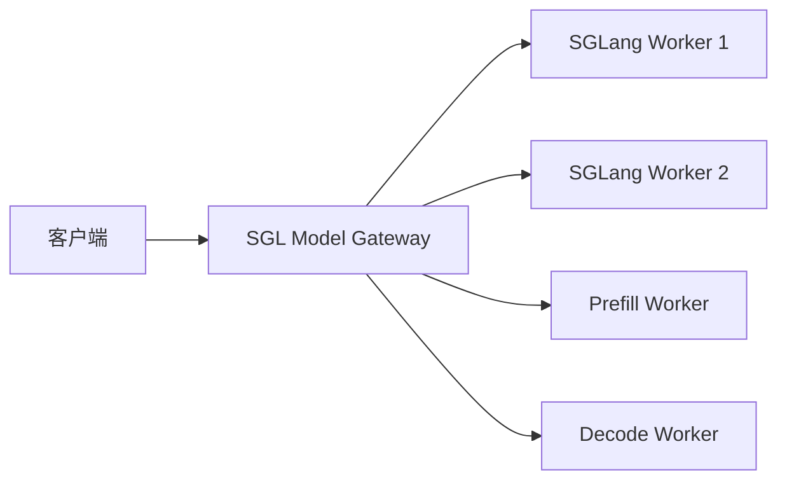
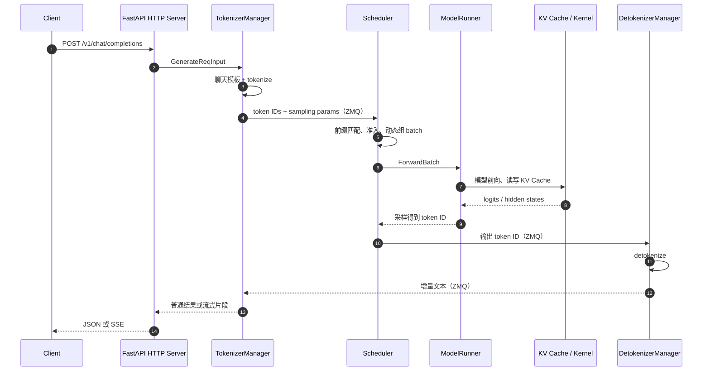
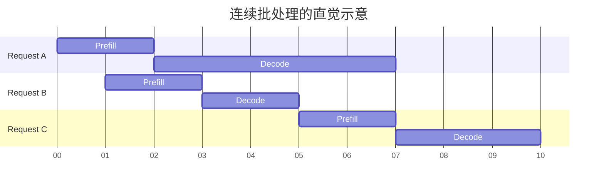
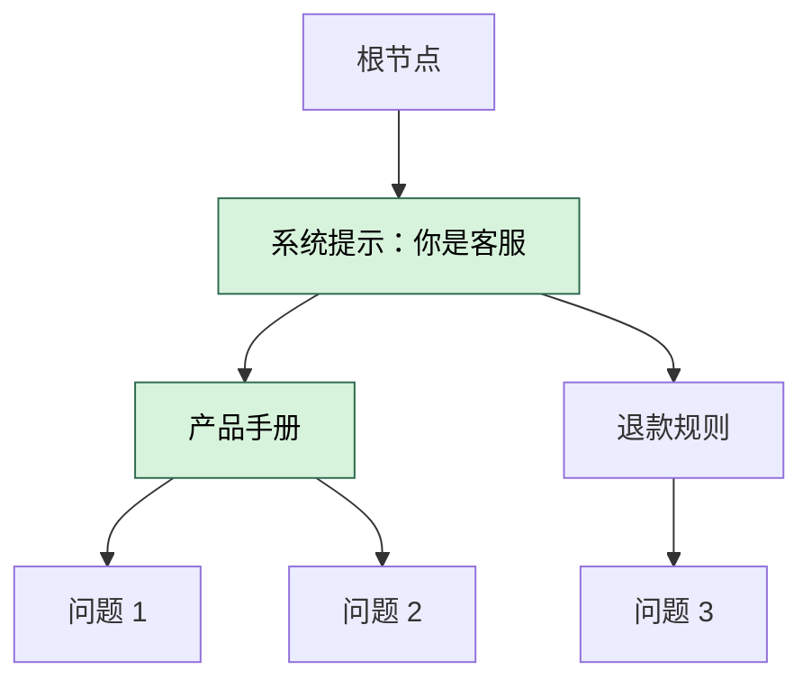
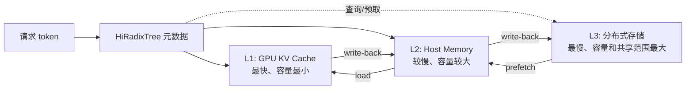
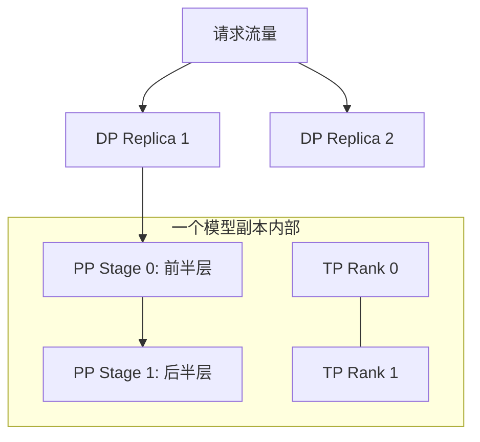
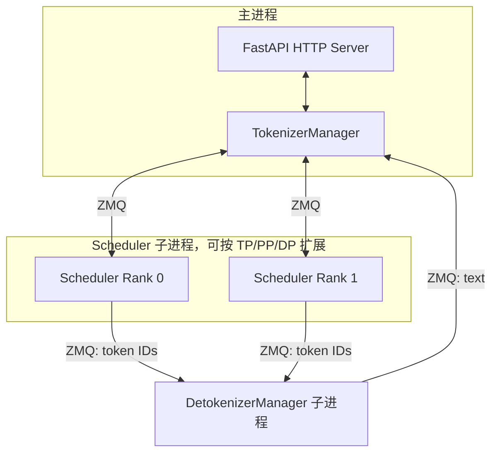
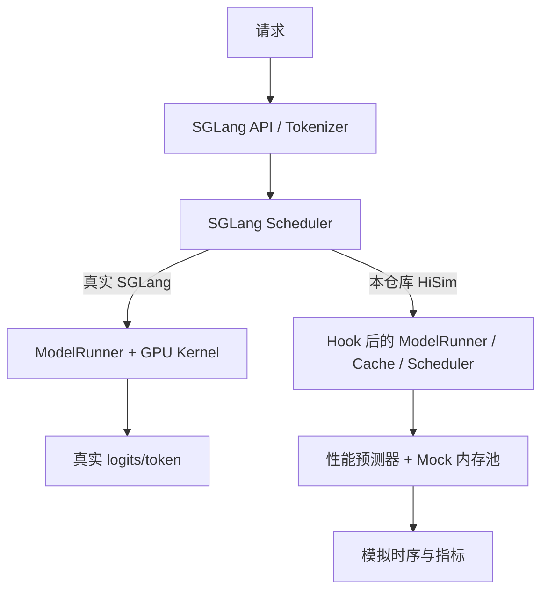
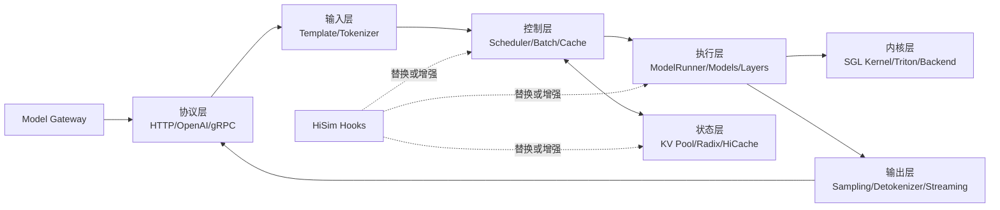

# SGLang 新手导览：从一次请求理解项目结构与核心功能

[返回仿真文档导航](../README.md)

> 本文基于本仓库固定的 SGLang `0.5.6.post2` 快照（commit `5c8bd8b51b`）讲解。
> 目标不是罗列每个文件，而是帮你先建立一张能用于阅读源码的“心智地图”。

## 1. 先用一句话认识 SGLang

SGLang 是一个面向大语言模型（LLM）和视觉语言模型（VLM）的高性能推理与服务框架。

它主要解决这样一个问题：

> 模型权重已经准备好了，怎样让大量用户通过 HTTP 或 Python API，以尽可能低的延迟和尽可能高的吞吐量使用它？

模型本身负责“算出下一个 token”，SGLang 则负责模型之外的大量工程工作：

- 接收 OpenAI 兼容请求；
- 应用聊天模板并执行 tokenizer；
- 把同时到来的请求动态组成批次；
- 管理 GPU、CPU 和外部存储中的 KV Cache；
- 选择并调用合适的 Attention、GEMM、MoE 等计算内核；
- 在多张 GPU、多个节点之间拆分模型和流量；
- 把 token 还原成文字并以流式响应返回；
- 提供指标、追踪、权重更新、LoRA、结构化输出等生产能力。

仓库自己的概括可见 [SGLang README](../../../third_party/sglang/README.md#about)。当前 Python 包的版本声明位于 [python/pyproject.toml](../../../third_party/sglang/python/pyproject.toml)。

## 2. 用“餐厅”理解 SGLang

第一次接触推理引擎时，可以把它想象成一家繁忙的餐厅：


| SGLang 组件          | 餐厅类比        | 实际职责                           |
| ------------------ | ----------- | ------------------------------ |
| HTTP Server        | 前台/服务员      | 接收请求，校验协议，返回普通或流式响应            |
| TokenizerManager   | 翻译员         | 把文字转成 token ID，把请求交给后厨         |
| Scheduler          | 后厨总调度       | 决定哪些请求本轮一起计算、谁先算、谁等待           |
| ModelRunner        | 厨师          | 真正执行模型前向计算                     |
| KV Cache           | 半成品和备料      | 保存历史 token 的中间结果，避免重复计算        |
| Radix Cache        | 按公共菜底组织的备料架 | 让共享前缀的请求复用相同 KV Cache          |
| SGL Kernel         | 炉灶和专业厨具     | 提供 Attention、GEMM、MoE、量化等高性能算子 |
| DetokenizerManager | 出餐翻译员       | 把输出 token ID 还原成文字             |
| Model Gateway      | 总店流量调度中心    | 在多个 SGLang 服务实例之间选择后端、容错和限流    |


这个类比最重要的一点是：**Scheduler 不是模型，ModelRunner 也不是 HTTP Server**。它们分工协作，才组成完整的在线推理服务。

## 3. 从仓库顶层看项目

`third_party/sglang` 是完整的上游仓库快照，而不只是一个 Python 包。可以先把它压缩成下面这棵树：

```text
third_party/sglang/
├── python/sglang/          # Python 主包：前端语言、推理 Runtime、CLI、扩散模型
│   ├── lang/               # SGLang Frontend Language
│   ├── srt/                # SGLang Runtime，LLM/VLM 服务核心
│   ├── multimodal_gen/     # 图像/视频扩散模型推理
│   ├── cli/                # `sglang serve`、`sglang generate`
│   ├── eval/               # 评测支持
│   └── jit_kernel/         # 运行时编译的内核相关代码
├── sgl-kernel/             # CUDA/C++/ROCm 高性能算子及 Python binding
├── sgl-model-gateway/      # Rust 实现的多实例路由和控制平面
├── benchmark/              # 性能和任务基准
├── test/                   # Runtime、nightly、注册测试等
├── examples/               # API、Runtime、监控、Profiler 示例
├── docs/                   # 安装、用法、高级特性、模型支持、开发指南
├── docker/                 # 镜像和部署配置
├── scripts/                # CI、发布、开发辅助脚本
└── 3rdparty/               # 仓库内依赖或平台代码
```

### 3.1 `python/sglang/lang`：编排 LLM 应用的前端语言

这里提供 `function`、`system`、`user`、`assistant`、`gen`、`select`、`image` 等接口。它允许开发者用 Python 表达多轮提示词、生成、选择、控制流和多模态输入，再把执行交给 SGLang Runtime、OpenAI、Anthropic 等后端。

例如，概念上可以写成：

```python
import sglang as sgl

@sgl.function
def answer_question(s, question):
    s += sgl.system("你是一位耐心的老师。")
    s += sgl.user(question)
    s += sgl.assistant(sgl.gen("answer", max_tokens=128))
```

公开 API 可从 [sglang/**init**.py](../../../third_party/sglang/python/sglang/__init__.py) 看到，解释和执行逻辑主要位于 [lang/interpreter.py](../../../third_party/sglang/python/sglang/lang/interpreter.py) 与 [lang/ir.py](../../../third_party/sglang/python/sglang/lang/ir.py)。

注意：前端语言是“怎样描述一个 LLM 程序”；`srt` 则是“怎样高效运行模型”。只使用 OpenAI API 时，通常不需要先掌握前端语言。

### 3.2 `python/sglang/srt`：最核心的推理 Runtime

`SRT` 可以理解为 **SGLang Runtime**。初学者最值得关注的子目录如下：


| 目录                    | 主要职责                               | 新手首先看什么                               |
| --------------------- | ---------------------------------- | ------------------------------------- |
| `entrypoints/`        | HTTP、gRPC、Python Engine 入口         | `http_server.py`、`engine.py`          |
| `managers/`           | tokenizer、调度、反 tokenizer、数据并行控制    | `tokenizer_manager.py`、`scheduler.py` |
| `model_executor/`     | 模型执行、CUDA Graph、ForwardBatch       | `model_runner.py`                     |
| `models/`             | Llama、Qwen、DeepSeek、Gemma 等模型实现和注册 | `registry.py`、`llama.py`              |
| `model_loader/`       | 配置、权重加载和校验                         | `loader.py`                           |
| `layers/`             | Attention、MoE、量化、LoRA、归一化等模型层      | `attention/`                          |
| `mem_cache/`          | KV 内存池、Radix Cache、HiCache 和存储后端   | `radix_cache.py`、`hiradix_cache.py`   |
| `distributed/`        | TP/PP/EP 等并行组与通信                   | `parallel_state.py`                   |
| `constrained/`        | JSON Schema、正则等受约束生成               | 从具体 backend 开始                        |
| `speculative/`        | 推测解码                               | 根据使用的算法阅读                             |
| `disaggregation/`     | Prefill/Decode 分离                  | `base/` 和所用传输后端                       |
| `multimodal/`         | 图片、视频等输入预处理                        | `processors/`                         |
| `metrics/`、`tracing/` | 指标和链路追踪                            | 生产部署时再深入                              |


服务参数集中在 [srt/server_args.py](../../../third_party/sglang/python/sglang/srt/server_args.py)。这个文件很大，是了解“当前版本究竟支持什么能力”的实用索引，但不适合作为第一份源码阅读材料。

### 3.3 `sgl-kernel`：高性能算子层

`sgl-kernel` 不是另一个服务，而是 Runtime 调用的底层计算工具箱。其 `csrc/` 按能力分成：

- `attention/`：Attention 和 MLA 相关算子；
- `gemm/`：矩阵乘；
- `moe/`：Mixture-of-Experts；
- `quantization/`：量化与反量化；
- `allreduce/`：多 GPU 通信；
- `kvcacheio/`：KV Cache 搬运；
- `speculative/`：推测解码相关算子；
- `mamba/`：Mamba/线性模型相关算子；
- `elementwise/`、`memory/` 等其他基础算子。

Python Runtime 会根据硬件、模型和启动参数选择内核后端。例如 `srt/layers/attention/` 中同时存在 FlashInfer、FlashAttention、Triton、FlashMLA、TRT-LLM、Torch Native、Intel AMX 等后端。

因此，“SGLang 快”并不是某一个文件的功劳，而是调度、缓存、批处理和内核共同作用的结果。

### 3.4 `sgl-model-gateway`：多个服务实例之前的网关

当只有一台机器、一个 SGLang Server 时，可以不使用 Model Gateway。规模扩大后，Gateway 位于客户端和多个推理实例之间：




它的 Rust 代码位于 `sgl-model-gateway/src/`，主要提供：

- worker 注册、健康检查与服务发现；
- round-robin、random、cache-aware、power-of-two 等负载均衡；
- Prefill/Decode 分离路由；
- 重试、熔断、限流和排队；
- HTTP、gRPC、OpenAI 兼容协议；
- Prometheus、OpenTelemetry 等可观测能力。

详细边界可见 [SGLang Model Gateway README](../../../third_party/sglang/sgl-model-gateway/README.md#architecture-at-a-glance)。

需要特别区分两层调度：

- **Gateway 调度实例**：这个请求应该交给哪台 worker？
- **Runtime Scheduler 调度批次**：某台 worker 内，这一轮应该计算哪些请求？

### 3.5 `multimodal_gen`：图像和视频生成

`python/sglang/multimodal_gen` 是扩散模型运行时，服务于图片和视频生成，不要与“LLM 接收图片后输出文字”的 VLM 推理混淆。

它采用可组合 Pipeline：提示词编码、去噪循环、VAE 解码等步骤分别是可复用的 `PipelineStage`。相关设计见 [support_new_models.md](../../../third_party/sglang/python/sglang/multimodal_gen/docs/support_new_models.md#architecture-overview)。

## 4. 一次文本请求究竟怎样运行

先启动一个普通 SGLang 服务：

```bash
python -m sglang.launch_server \
  --model-path Qwen/Qwen3-8B \
  --host 0.0.0.0 \
  --port 30000
```

然后发送 OpenAI 兼容请求：

```bash
curl http://127.0.0.1:30000/v1/chat/completions \
  -H 'Content-Type: application/json' \
  -d '{
    "model": "Qwen/Qwen3-8B",
    "messages": [
      {"role": "user", "content": "用一句话解释 KV Cache"}
    ],
    "temperature": 0,
    "max_tokens": 64
  }'
```

> 命令用于帮助理解标准用法；能否在本机实际运行取决于模型文件、硬件和依赖是否已准备好。

### 4.1 总体链路




这不是根据名字猜出来的：服务入口的代码注释直接描述了三个核心组件和进程关系，见 [`http_server.py` 的 `launch_server`](../../../third_party/sglang/python/sglang/srt/entrypoints/http_server.py#L1369)。

### 4.2 第一步：HTTP Server 解析协议

`srt/entrypoints/http_server.py` 使用 FastAPI 暴露接口，包括：

- `/v1/chat/completions`；
- `/v1/completions`；
- `/v1/responses`；
- embedding、rerank、score；
- health、server info、flush cache、update weights 等管理接口。

OpenAI 协议的数据结构和不同任务的处理逻辑位于 `srt/entrypoints/openai/`。协议层会把外部请求转换为 Runtime 内部统一的请求对象。

### 4.3 第二步：TokenizerManager 准备输入

以聊天请求为例，原始输入是带 `role` 的消息列表，不是模型能直接计算的张量。TokenizerManager 大致完成：

1. 选用模型对应的 chat template；
2. 把多轮消息拼成模型约定的文本格式；
3. 把文本编码成 token ID；
4. 整理温度、最大输出长度、stop、结构化输出等参数；
5. 生成内部请求并发送给 Scheduler；
6. 保存请求状态，以便把异步返回的输出对应回客户端。

假设模板处理后的文字是：

```text
<|im_start|>user
用一句话解释 KV Cache<|im_end|>
<|im_start|>assistant
```

Tokenizer 可能把它变成：

```text
[151644, 872, 198, 100204,  ... , 151645, 198, 151644, 77091, 198]
```

具体数字由 tokenizer 决定。重点是：从这一步开始，Scheduler 主要处理 token ID、缓存位置和批次，而不是自然语言字符串。

### 4.4 第三步：Scheduler 动态组成批次

传统静态批处理要等待一批请求全部结束，短请求会被长请求拖住。SGLang 使用 continuous batching（连续批处理）：在模型的一轮轮迭代之间，已完成请求可以退出，新请求可以加入。




Scheduler 每轮要综合考虑：

- 新请求和运行中请求；
- 剩余 KV Cache 空间；
- 请求优先级和调度策略；
- 可复用的前缀长度；
- chunked prefill；
- LoRA 是否兼容同批执行；
- 推测解码、结构化输出、PP/DP 等模式。

主循环位于 [managers/scheduler.py](../../../third_party/sglang/python/sglang/srt/managers/scheduler.py)。它创建 `TpModelWorker`，后者再创建 [ModelRunner](../../../third_party/sglang/python/sglang/srt/model_executor/model_runner.py) 执行模型。

### 4.5 第四步：Prefill 和 Decode

一次生成通常包含两个阶段：


| 阶段      | 输入            | 每次处理量         | 直觉                |
| ------- | ------------- | ------------- | ----------------- |
| Prefill | 整段 prompt     | 许多 token      | 先读完问题并建立 KV Cache |
| Decode  | 已有上下文 + 上一个输出 | 通常每轮一个新 token | 一个字/词元接一个字/词元地回答  |


假设 prompt 有 1,000 个 token，需要输出 100 个 token：

- Prefill 处理这 1,000 个输入 token；
- 随后的 Decode 迭代约进行 100 轮；
- 每轮都复用之前保存的 K/V，而不是重新计算全部历史 token。

这就是 KV Cache 的基本价值。代价是它会占用大量显存，因此“怎样分配、复用、淘汰、搬运 KV Cache”是推理引擎的核心问题。

### 4.6 第五步：ModelRunner 与内核完成计算

`TpModelWorker` 将 Scheduler 形成的批次交给 ModelRunner。ModelRunner 负责把模型、设备、Attention backend、CUDA Graph、内存池等执行细节组织起来。

可以把调用层级简化为：

```text
Scheduler
  └── TpModelWorker
        └── ModelRunner
              └── 模型实现（如 Qwen/Llama/DeepSeek）
                    └── layers
                          └── sgl-kernel / Triton / 第三方 Attention backend
```

`srt/models/` 中的文件描述模型结构和权重映射，`model_loader/` 负责加载权重，`layers/` 提供可复用层，`sgl-kernel` 提供更底层的高性能实现。

### 4.7 第六步：采样、detokenize 和流式返回

模型前向输出的是 logits，即词表中每个候选 token 的分数。采样模块依据 temperature、top-p、top-k、惩罚项和约束条件选择下一个 token ID。

DetokenizerManager 再把 token ID 增量解码成文本，并处理 stop string 等边界。结果经 TokenizerManager 对应回原请求，最后由 HTTP Server 返回 JSON，或通过 SSE 持续推送。

## 5. 为什么 RadixAttention 能复用前缀

假设三个请求是：

```text
A: [系统提示：你是客服] + [产品手册] + 问题 1
B: [系统提示：你是客服] + [产品手册] + 问题 2
C: [系统提示：你是客服] + [退款规则] + 问题 3
```

A 和 B 有很长的公共前缀。普通做法会分别执行两次 Prefill；Radix Cache 用 radix tree 按 token 前缀组织 KV Cache，从而复用已经计算过的部分。




当 B 到来时，系统可以命中“系统提示 + 产品手册”的缓存，只计算“问题 2”及其后续内容。

需要注意：

- 复用依据是 tokenizer 之后的 token 前缀完全相同；
- 前缀缓存主要减少 Prefill 计算，不会让每个 Decode token 都免费；
- 缓存容量有限，需要配合引用计数和淘汰策略；
- `page_size` 会影响匹配粒度、元数据开销和 I/O 效率。

实现集中在 [srt/mem_cache](../../../third_party/sglang/python/sglang/srt/mem_cache/)，其中包括 `radix_cache.py`、`memory_pool.py`、`allocator.py` 和不同变体。

## 6. Paged Attention 与 Radix Cache 不是一回事

这两个概念容易混淆：

- **Paged Attention / 分页内存池**解决“KV Cache 在物理内存中怎样分块存放和寻址”；
- **Radix Cache**解决“不同请求之间怎样根据公共 token 前缀找到并复用 KV Cache”。

可以把前者理解为仓库货架的格子和编号方式，把后者理解为库存目录的组织方式。两者相互配合，但关注点不同。

## 7. HiCache：把 KV Cache 扩展为多级缓存

GPU 显存最快，但容量有限。SGLang HiCache 将缓存扩展成类似 CPU 缓存的层级：




它的主要流程是：

1. **local match**：先在 L1/L2 的 HiRadixTree 中查找公共前缀；
2. **prefetch**：本地未命中的部分尝试从 L3 拉到 Host Memory；
3. **load**：计算需要的数据进入 GPU；
4. **write-back**：新产生或被淘汰的 KV Cache 按策略写回 L2/L3。

详细设计见 [HiCache System Design](../../../third_party/sglang/docs/advanced_features/hicache_design.md)。代码主要位于：

- `mem_cache/hiradix_cache.py`：分层 radix tree；
- `mem_cache/hicache_storage.py`：存储抽象；
- `mem_cache/memory_pool_host.py`：Host KV Cache；
- `managers/cache_controller.py`：缓存搬运协调；
- `mem_cache/storage/`：L3 backend 工厂和实现入口。

## 8. 多 GPU 和多节点并行怎样理解

SGLang 支持多种并行方式。新手先记住“切什么”即可：


| 并行方式                  | 切分对象           | 适合解决的问题               |
| --------------------- | -------------- | --------------------- |
| TP（Tensor Parallel）   | 一层内部的矩阵/张量     | 单张 GPU 放不下模型，或要加速单次前向 |
| PP（Pipeline Parallel） | 不同模型层          | 按层把模型放到不同设备/节点        |
| DP（Data Parallel）     | 请求流量/模型副本      | 提高整体吞吐量               |
| EP（Expert Parallel）   | MoE 的不同 expert | 大型 MoE 模型的容量与通信优化     |





实际组合比图复杂。当前快照会在 `_launch_subprocesses` 中根据 `dp_size`、`tp_size`、`pp_size`、节点 rank 等参数创建 Scheduler 或 DataParallelController，见 [entrypoints/engine.py](../../../third_party/sglang/python/sglang/srt/entrypoints/engine.py#L783)。

## 9. SGLang 的进程模型

默认 HTTP 模式下，最重要的进程关系是：




这样拆分有几个直觉上的好处：

- tokenizer/detokenizer 的 CPU 工作不会全部塞进模型执行循环；
- 每个 GPU rank 可以拥有独立 Scheduler/worker 状态；
- 组件通过明确消息边界协作；
- HTTP 层与模型执行层可以独立演进。

但也带来调试复杂度：日志来自多个进程，异常有时会表现为某条 ZMQ 链路断开。因此读启动日志时要先确认是 HTTP、Tokenizer、Scheduler、ModelRunner 还是 Detokenizer 报错。

## 10. 常见高级功能放在哪一层


| 功能                   | 主要所在层                           | 说明                                      |
| -------------------- | ------------------------------- | --------------------------------------- |
| OpenAI API           | `entrypoints/openai/`           | 协议转换、chat/completion/responses 等        |
| 结构化输出                | `constrained/`                  | 用 grammar/regex/JSON schema 限制 token 选择 |
| Tool Calling         | `function_call/`、OpenAI serving | 解析或约束工具调用格式                             |
| Speculative Decoding | `speculative/`                  | 用 draft 结果减少大模型解码成本                     |
| LoRA                 | `lora/`                         | 动态 adapter 和多 LoRA batch                |
| 量化                   | `layers/quantization/`          | FP8、INT4、AWQ、GPTQ 等路径                   |
| PD Disaggregation    | `disaggregation/`               | 将 Prefill 和 Decode 部署到不同 worker         |
| HiCache              | `mem_cache/`、cache controller   | GPU、Host、L3 多级 KV Cache                 |
| Metrics/Tracing      | `metrics/`、`tracing/`           | Prometheus、请求指标和链路追踪                    |
| 权重热更新                | Scheduler、Engine、`weight_sync/` | 不重启服务更新相同结构的权重                          |
| Diffusion            | `multimodal_gen/`               | 图片和视频生成 Pipeline                        |


## 11. 本仓库中的 HiSim 和 SGLang 是什么关系

本仓库不是单纯运行原版 SGLang，而是把固定版本的 SGLang 当作被模拟对象。核心思路是：

> 尽量保留 SGLang 的请求、tokenizer、调度、批次和缓存控制流程，但用 Hook 替换真正昂贵的模型与硬件计算，从而在 CPU 环境预测运行时间和缓存行为。

### 11.1 两条路径对比




HiSim 不是重新实现一套完全独立的调度器。它先安装 Hook，再导入 SGLang：

```python
# 先注册 Hook
hisim_hook.install_class_hooks([...])

# 后导入 SGLang Engine
from sglang.srt.entrypoints.engine import Engine
```

这段顺序可以在 [sglang_bench.py](../../../third_party/tair-kvcache/hisim/src/hisim/simulation/sglang/sglang_bench.py) 中看到。如果先导入目标类再装 Hook，替换可能无法覆盖初始化过程。

### 11.2 HiSim 主要 Hook 了什么

入口 [hisim/simulation/sglang/launch_server.py](../../../third_party/tair-kvcache/hisim/src/hisim/simulation/sglang/launch_server.py) 注册了：

- `C_SchedulerHook`：介入调度循环和模拟时间推进；
- `C_ModelRunnerHook`：不加载/执行真实大模型，建立 Mock 模型和内存池；
- `C_TokenizerManagerHook`：把模拟需要的创建时间等信息带入请求；
- `C_StorageBackendFactory`：替换或适配存储 backend；
- `C_HiCacheController`：模拟分层缓存控制；
- `C_HiRadixCacheHook`：模拟 HiRadixCache 行为；
- CPU 环境下的 SGL Kernel module hook：绕开不适用的 GPU 内核加载。

Hook 的具体实现位于 [sglang_hook.py](../../../third_party/tair-kvcache/hisim/src/hisim/simulation/sglang/sglang_hook.py)，Mock 对象位于 [sglang_mock_class.py](../../../third_party/tair-kvcache/hisim/src/hisim/simulation/sglang/sglang_mock_class.py)。

### 11.3 为什么仍然需要完整 SGLang 源码

因为 HiSim 复用的是 SGLang 的真实控制流和内部类型：

- `ServerArgs` 解析；
- `Engine` 与子进程组织；
- `TokenizerManager` 的请求生命周期；
- `Scheduler` 的 batch 和 cache 决策；
- `Req`、`ScheduleBatch` 等内部数据结构；
- Radix/HiCache 的接口和元数据逻辑。

因此 HiSim 对 SGLang 版本比较敏感。本仓库把上游固定在 `0.5.6.post2`，并在 Docker 构建中从本地源码安装。构建过程见 [Dockerfile](../../../Dockerfile)，兼容版本检查见 [hisim/simulation/sglang/version.py](../../../third_party/tair-kvcache/hisim/src/hisim/simulation/sglang/version.py)。

### 11.4 CPU 镜像并不代表原版 SGLang 在 CPU 上完整执行 Qwen3-8B

本项目的 CPU-only 镜像主要服务于模拟：

- 构建时应用 CPU fallback patch；
- HiSim Hook 替代真实 ModelRunner 计算与部分内存/缓存对象；
- 保留 SGLang 服务和调度接口；
- 用硬件、模型和调度配置驱动时间预测器；
- 输出模拟指标，而不是依赖 GPU 完成真实模型推理。

Docker 服务入口实际执行的是：

```text
python -m hisim.simulation.sglang.launch_server
```

而不是直接执行：

```text
python -m sglang.launch_server
```

可在 [docker/entrypoint.sh](../../../docker/entrypoint.sh) 中确认这一边界。

## 12. 用一个重复前缀例子串起 SGLang 与 HiSim

假设基准测试依次发送两条请求：

```text
请求 A：阅读下面的 10,000-token 文档，然后回答“作者是谁？”
请求 B：阅读同一份 10,000-token 文档，然后回答“结论是什么？”
```

### 在真实 SGLang 中

1. A 到达后，TokenizerManager 生成 token ID；
2. Scheduler 未找到缓存，为 A 执行长 Prefill；
3. 产生的 KV Cache 被 Radix/HiCache 记录；
4. B 到达后匹配到长公共前缀；
5. 如果缓存仍在 GPU，直接复用；如果在 Host/L3，按策略预取和加载；
6. 只对未命中的问题尾部执行 Prefill，再进入 Decode；
7. B 的 TTFT（首 token 延迟）通常因此降低。

### 在本仓库 HiSim 中

1. 请求仍经过 SGLang 的 tokenizer、请求对象和 Scheduler；
2. Hook 后的缓存对象模拟容量、命中、分配与搬运；
3. Hook 后的 ModelRunner 不做完整神经网络计算；
4. 时间预测器根据模型、硬件、batch、token 数等特征估算阶段耗时；
5. 模拟时钟和统计信息记录 A、B 的排队、Prefill、Decode 与缓存效果；
6. 最终用这些结果评估部署配置，而无需真的占用目标 GPU 集群跑完整工作负载。

这也是本仓库保留 SGLang Scheduler 和 HiCache 结构的意义：模拟结果需要尽量遵循目标引擎的真实决策路径。

## 13. 新手推荐的源码阅读顺序

不要从 `scheduler.py` 第一行开始硬啃。推荐分五轮：

### 第一轮：只建立全局图

1. [SGLang README](../../../third_party/sglang/README.md#about)
2. [launch_server.py](../../../third_party/sglang/python/sglang/launch_server.py)
3. [http_server.py 的架构注释](../../../third_party/sglang/python/sglang/srt/entrypoints/http_server.py#L1369)
4. [Engine 公共 API](../../../third_party/sglang/python/sglang/srt/entrypoints/engine.py#L93)

目标：能复述 HTTP、Tokenizer、Scheduler、ModelRunner、Detokenizer 的关系。

### 第二轮：跟一条请求

1. `entrypoints/openai/serving_chat.py`
2. `managers/tokenizer_manager.py`
3. `managers/io_struct.py`
4. `managers/scheduler.py` 中的接收和 event loop
5. `managers/tp_worker.py`
6. `model_executor/model_runner.py`

目标：知道请求对象在哪几处变形、在哪一层进入模型。

### 第三轮：理解 batch 与 KV Cache

1. `managers/schedule_batch.py`
2. `managers/schedule_policy.py`
3. `mem_cache/memory_pool.py`
4. `mem_cache/allocator.py`
5. `mem_cache/radix_cache.py`

目标：能解释请求为何进入/离开 batch，以及 token 怎样映射到 KV 槽位。

### 第四轮：根据场景选读高级能力

- 多级缓存：`hiradix_cache.py`、`hicache_storage.py`、HiCache 文档；
- PD 分离：`disaggregation/`；
- 多 GPU：`distributed/parallel_state.py` 和 Engine 的子进程启动；
- 性能内核：`layers/attention/` 和 `sgl-kernel/csrc/`；
- 新模型：`models/registry.py`、相近模型实现和支持新模型文档。

### 第五轮：再看 HiSim Hook

1. [HiSim launch_server.py](../../../third_party/tair-kvcache/hisim/src/hisim/simulation/sglang/launch_server.py)
2. [sglang_bench.py](../../../third_party/tair-kvcache/hisim/src/hisim/simulation/sglang/sglang_bench.py)
3. [sglang_hook.py](../../../third_party/tair-kvcache/hisim/src/hisim/simulation/sglang/sglang_hook.py)
4. [sglang_mock_class.py](../../../third_party/tair-kvcache/hisim/src/hisim/simulation/sglang/sglang_mock_class.py)
5. 时间预测器与 `StateManager`、`ConfigManager`

目标：区分哪些行为来自原版 SGLang，哪些行为被 HiSim 替换。

## 14. 调试时怎样快速定位目录


| 现象                        | 优先检查                                               |
| ------------------------- | -------------------------------------------------- |
| HTTP 404、请求字段错误           | `entrypoints/http_server.py`、`entrypoints/openai/` |
| chat template 或 token 数异常 | `TokenizerManager`、template、tokenizer 配置           |
| 请求一直排队                    | Scheduler 准入、KV 空间、batch 参数                        |
| OOM                       | `memory_pool.py`、KV dtype、最大 token 数、并行配置          |
| 前缀没有命中                    | token 是否完全相同、Radix Cache、page size、淘汰              |
| Host/L3 缓存没有工作            | HiCache 开关、storage backend、prefetch/write policy   |
| 多 GPU 卡住                  | rank 拓扑、distributed group、通信 backend、各进程日志         |
| 模型权重加载失败                  | `models/registry.py`、`model_loader/`、模型 config     |
| Attention backend 报错      | `layers/attention/`、硬件和已安装 kernel 版本               |
| HiSim 时间或缓存结果异常           | Hook 是否先安装、配置文件、预测器、模拟状态管理                         |


## 15. 最后记住这张最小心智地图




如果只记五句话，可以记这些：

1. SGLang 是模型推理服务系统，不只是一个模型实现库。
2. TokenizerManager 管输入输出关联，Scheduler 管每轮算谁，ModelRunner 负责真正执行模型。
3. 高吞吐来自连续批处理，高前缀复用来自 RadixAttention，高容量缓存来自 HiCache。
4. `sgl-kernel` 是单实例内部的算子层，`sgl-model-gateway` 是多个实例之前的路由层。
5. 本仓库的 HiSim 保留 SGLang 控制流，但 Hook 掉昂贵计算，用于 CPU 上的性能与缓存模拟。

## 16. 继续学习的本地资料

- [SGLang 文档目录](../../../third_party/sglang/docs/)
- [基础用法](../../../third_party/sglang/docs/basic_usage/)
- [高级特性](../../../third_party/sglang/docs/advanced_features/)
- [支持的模型](../../../third_party/sglang/docs/supported_models/)
- [开发者指南](../../../third_party/sglang/docs/developer_guide/)
- [示例](../../../third_party/sglang/examples/)
- [基准测试](../../../third_party/sglang/benchmark/)
- [本项目 README](../../../README.md)
- [HiSim-SGLang CPU Docker 操作说明](../../../README.md)
