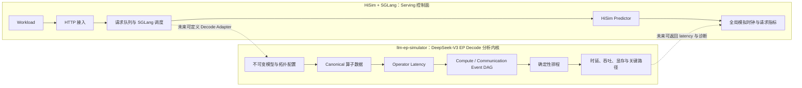
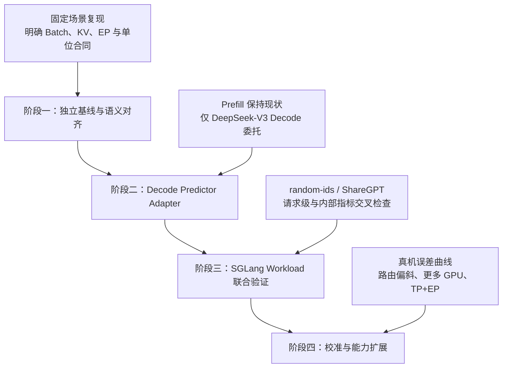

# llm-ep-simulator 对 HiSim + SGLang 的技术参考评估

[返回仿真文档导航](../README.md)

## 1. 项目定位

`llm-ep-simulator` 是面向 DeepSeek-V3 Decode 和 Expert Parallelism（EP）的确定性解析模拟器。它以 H800/H20 算子性能数据为锚点，将一次 Decode forward 展开为 61 层的 Operator、Stage 和 Event DAG，估算计算、通信、显存、吞吐、关键路径及资源重叠。

该项目不运行真实 CUDA kernel，不模拟 CUDA stream、SM 调度或 GPU cycle，也不是 HTTP 推理服务。其核心价值在于提供一个透明、可审计的 DeepSeek-V3 EP Decode 分析内核。

HiSim + SGLang 与其定位不同：前者保留真实 SGLang HTTP、请求队列和调度流程，并由 predictor 为实际调度 batch 提供模拟 forward latency；后者不含 serving 控制面，而是在给定静态配置和 Local Batch 后，对一个封闭的 DeepSeek-V3 Decode 模型进行细粒度分析。二者具有互补关系，但当前尚未完成集成。

`third_party/llm-ep-simulator` 已作为固定提交的参考型 submodule 纳入仓库，recursive clone 会获取其源码。它当前不安装进 Docker 镜像，不参与 HiSim runtime 或 preflight；纳入源码管理不代表二者已经集成。



## 2. 能力对比

| 维度 | HiSim + SGLang 当前能力 | llm-ep-simulator 当前能力 | 互补价值 |
| --- | --- | --- | --- |
| 服务与调度 | 真实 SGLang HTTP、队列、batch 形成和请求生命周期 | 不含 serving server，输入为静态配置和 Local Batch | 可由 SGLang 提供真实 batch，EP 内核提供 Decode 细分时延 |
| 模型范围 | 当前实测为 Qwen3-8B；predictor 代码存在部分 MoE 类型入口 | 只支持固定 DeepSeek-V3：3 Dense + 58 MoE 层 | 可补充一个 DeepSeek-V3 专用、透明的 Decode predictor 路径 |
| 推理阶段 | predictor 同时处理 Prefill 与 Decode | 只处理 Decode | 适合分工，而不是整体替换现有 predictor |
| 并行建模 | 当前验证为 TP=EP=1，尚无多卡实测结论 | 单一 EP Group，EP 为 8–256 范围内的 8 的倍数；无 TP、多个 DP replica 或多个 EP Group | 可为 EP 研究提供起点，但不能证明 TP+EP 或真实多卡能力 |
| 算子模型 | AIConfigurator 数据库和可选 XGBoost 修正，主要返回 batch 总时延 | Dense、Grouped GEMM、BMM、FlashMLA 分项估算 | 可增强时延来源、外推状态和算子瓶颈的可解释性 |
| 通信模型 | 当前项目未实测复杂 TP/EP collective 路径 | Dispatch/Combine 的 intra/inter fabric 解析模型 | 可为 MoE all-to-all 类流量建立第一版可检查模型 |
| 调度细节 | SGLang 外层请求调度与全局时钟 | 层内 Compute/Communication 两资源 Event DAG | 可连接 serving 调度和模型内部计算通信重叠 |
| 显存与搜索 | 当前以既有 predictor 行为为主 | 常驻权重、KV cache、memory-safe batch、batch search | 可扩展容量解释和离线候选筛选 |
| 输出 | 请求级吞吐、TTFT、TPOT、ITL 等 | Stage/Operator breakdown、Timeline、Critical Path、通信 Bytes | 可形成请求级与模型内部诊断的两层报告 |

## 3. Top 5 可借鉴项

### 3.1 Canonical 数据合同与外推标记

项目把原始参考快照、离线 canonicalization 和运行时查询彻底分离。H800/H20 分别保存 Dense GEMM、Masked Grouped GEMM、Batched GEMM 和 FlashMLA 四类数据；查询禁止跨 hardware、Operator Family、固定 shape、dtype、`q_seq_len` 或 `varlen` 静默 fallback。

每次查询只返回 `latency_s` 与二值 `is_extrapolated`：它能显式提示结果是否含外推成分，但不能区分 exact hit 与区间插值，也不能区分边界外推与 proxy。HiSim 可借鉴其“禁止静默 fallback”的原则，并进一步为 predictor 的算子或阶段结果增加 `exact`、`interpolated`、`extrapolated`、`proxy` 等来源分类，减少仅依靠整体 profile 标签解释预测边界的问题。

重点参考模块：`DATA.md`、`reference.py` 和 `tools/build_canonical_data.py`。

### 3.2 Expert placement 与轻重 Rank Class

项目使用 `divmod(256, ep_size)` 计算单层 routed expert 的 light/heavy rank class，并分别估算两类 grouped GEMM latency，以较慢类别作为 RoutedExpertCompute Event duration。显存侧则按 `ceil(58 × 256 / ep_size)` 计算常驻 routed expert instance 最多的 rank。

这一设计把“单层计算瓶颈”和“跨层常驻显存瓶颈”分开表达，适合补充 HiSim 当前 MoE/EP 参数入口的可解释性。重点参考模块：`modeling.py` 中的 expert placement、RoutedEventDetails 和 memory capacity。

### 3.3 Dispatch/Combine 通信模型

项目分别计算 requester 侧与 expert 侧的 intra/inter expected bytes，并按两侧较大流量确定每级 fabric 瓶颈。Dispatch 按 `hidden_size × 1 Byte` 计算单 assignment payload，Combine 按 `hidden_size × 2 Bytes`；每级通信时延为：

```text
latency = bottleneck_bytes / effective_bandwidth + startup_latency
```

intra/inter fabric 被假定可并行，因此通信 Event 时延取两级时延的最大值。该模型虽简化，但变量、方向和单位明确，可作为 HiSim DeepSeek EP 通信建模的低风险起点。重点参考模块：`modeling.py` 中的 `_fabric_level`、`_communication_details` 和 CommunicationEventDetails。

### 3.4 Compute/Communication Event DAG

每个 MoE 层被展开为两条并行因果路径：

```text
Attention ─→ SharedExpertCompute ──────────────┐
         └─→ Dispatch → RoutedCompute → Combine ├─→ 下一层
                                                ┘
```

Compute 和 Communication 各自是一条串行、不可抢占资源队列，两者可以重叠。与只返回一个 batch 总 forward latency 相比，这种 Event DAG 能说明通信被隐藏了多少、哪个阶段处于关键路径，以及 micro-batch interleave 是否有效。

重点参考模块：`modeling.py` 的 DAG materializer、`scheduler.py` 的 CausalEventDAG、ResourceOrderDAG 和 `schedule()`。

### 3.5 Critical Path、显存、Batch Search 与报告

结果同时包含 makespan、三类吞吐、显存分解、通信 Bytes、Stage/Operator 累计时延、Timeline、Critical Path 和 extrapolation 状态。`find_best_batch` 穷举 memory-safe Local Batch，可附加最低 UX token rate 约束；报告明确区分资源累计工作时延、计算通信 overlap 与端到端 makespan。

HiSim 可借鉴其报告结构，为一次 SGLang benchmark 同时提供请求级指标和 predictor 内部瓶颈解释。重点参考模块：`simulation.py`、`batch_search.py`、`reporting.py` 和 `visualization.py`。资源顺序搜索可作为后续离线研究工具，不宜首期进入 serving 主路径。

## 4. 不能直接照搬的部分

### 4.1 Decode only

该项目不建模 Prefill。HiSim 的 SGLang 接入需要同时处理 Prefill、Chunked Prefill 和 Decode，因此不能用它整体替换现有 predictor。较合理的边界是：现有 predictor 继续负责 Prefill，DeepSeek-V3 的 Decode batch 在满足明确条件时才委托专用 EP adapter。

### 4.2 Local Batch 语义不同

`llm-ep-simulator` 的 `batch_size_per_rank` 是其公式体系中的 EP Rank Local Batch，集群 accepted tokens 按 `batch_size_per_rank × ep_size` 计算。SGLang hook 当前提供的是实际 scheduler batch 中的请求集合。两者不能仅凭数值相等直接映射，必须先定义：一个 SGLang batch 如何投影为 Local Batch、每个 EP rank 是否处理相同 sequences，以及返回 latency 对应一次 forward 还是一个独立分析周期。

### 4.3 KV cache 固定为 5000

模型使用固定 KV cache length 5000 计算容量，FlashMLA reference 也固定 mean KV length 5000。`varlen=True` 只选择另一类 FlashMLA reference，并不消费 SGLang 请求的真实 past-KV 长度分布。因此，直接接入会丢失当前 SGLang batch 中不同上下文长度的信息。

### 4.4 Uniform routing

项目假设每个 routed expert 获得相同的期望 assignments，只建模 expert 数量不能整除 EP size 时的轻重 rank class。它不模拟热门 expert、token skew、capacity drop、动态迁移或显式 expert-to-rank placement，可能低估真实 MoE 的热点、负载不均衡和尾延迟。

### 4.5 Proxy 与恒定外推状态

Dense FFN 使用 Shared Expert 的有效 TFLOPS proxy，BMM 使用 BF16 测量除以 1.7 的 FP8 proxy；因此完整 Simulation Run 的 `contains_extrapolation` 恒为 `True`。这些结果适合趋势分析和交叉检查，不应直接升级为经过真机校准的性能承诺。

此外还有两个范围约束：当前只支持 H800/H20，不能向其他 GPU 泛化；当前只有一个 EP Group，不支持 TP、TP+EP、多个 DP replicas 或多个 EP Groups。

## 5. 运行环境兼容性

`llm-ep-simulator` 的包合同要求 Python `>=3.11`，而当前 HiSim + SGLang CPU Docker 环境使用 Python `3.10.12`。因此不能假定可以把该 package 原样安装到现有镜像。

低风险选择有两种：

1. 首期保持两个环境独立，通过离线 fixture 和结果对照验证语义；
2. 在进入正式 adapter 实现前，单独评估将联合镜像升级到 Python 3.11 对 SGLang `0.5.6.post2`、CPU PyTorch、HiSim 和 AIConfigurator 的兼容影响。

不建议为了绕过版本合同而直接复制少量源码，因为这会切断原项目的配置校验、数据合同、测试和外推标记，形成难以审计的第二套实现。

## 6. 推荐的四阶段低风险结合方式



### 阶段一：独立基线与语义对齐

保持 `llm-ep-simulator` 独立运行，复现固定 H20/H800、EP、SINGLE/DUAL 场景。形成正式映射说明，明确 SGLang batch、simulator Local Batch、`q_seq_len`、past-KV length、EP topology、输出 latency 和单位。此阶段不修改 HiSim predictor 行为。

### 阶段二：Decode Predictor Adapter

在 HiSim predictor 层设计 DeepSeek-V3 专用 adapter。Prefill 继续使用现有 AIConfigurator；只有模型、Decode mode、EP topology、batch 和数据条件全部满足时，才调用 EP simulator。首版只把 `makespan_s` 返回给 HiSim，同时将 `contains_extrapolation`、Stage breakdown、通信和关键路径作为诊断信息保存。

进入该阶段前必须解决 Python 3.11 运行环境问题，并确保失败时显式报错，不静默回退为其他硬件或模型的预测结果。

### 阶段三：SGLang Workload 联合验证

使用 SGLang 实际形成的 Decode batch 驱动 adapter，分别运行确定性短请求和 ShareGPT workload。交叉检查请求级 TTFT/TPOT/ITL 与内部 makespan、Stage、通信和 Critical Path，确认不同 batch 和 micro-batch 条件下的数据流一致。对于真实上下文长度，首版必须明确记录其被固定 KV=5000 模型归一化或拒绝，不能把它表述为已经参与时延计算。联合验证通过仍只说明集成路径正确，不代表真机预测精度。

### 阶段四：真机校准与能力扩展

使用目标 GPU 真机测量建立误差曲线。现有二值外推标记只能先支持“含外推/不含外推”的粗粒度分组；若要分别评估 exact、interpolated、extrapolated 和 proxy，必须新增来源分类元数据，或由外部依据查询条件可靠重建分类。随后再逐项扩展动态 KV length、非均匀 expert routing、更多目标 GPU 和 TP+EP，并在支持动态 KV 后验证上下文长度敏感性；每项能力均应补充 canonical 数据、配置合同、专项测试和独立校准，不能从现有 H20/H800 EP 结果直接外推。

## 7. 结论

`llm-ep-simulator` 最值得借鉴的是透明的数据合同、MoE placement、Dispatch/Combine 流量、Compute/Communication Event DAG，以及关键路径和显存报告，而不是将整个 package 直接嵌入现有运行链路。

建议先将其作为独立 DeepSeek-V3 Decode 参考模型，完成 batch、KV 和 topology 语义对齐；再通过受限 predictor adapter 接入 HiSim。只有经过 SGLang workload 联合验证和目标 GPU 真机校准后，才能把相应能力表述为已集成或可用于性能判断。
